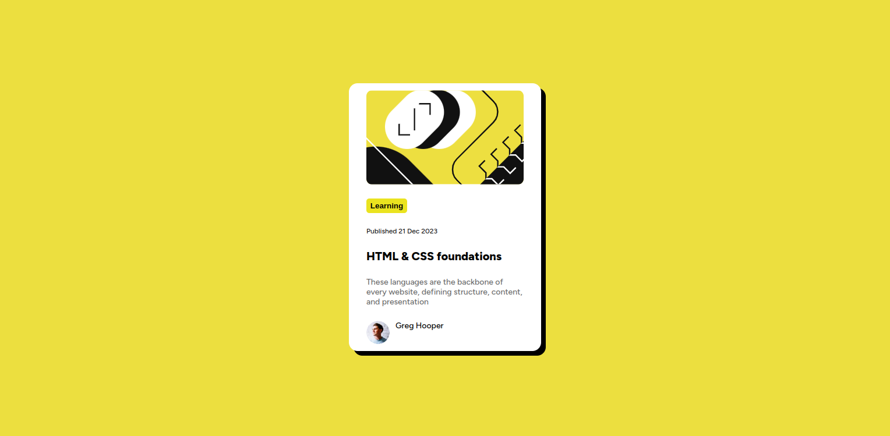

# Frontend Mentor - Blog preview card

## Welcome! 👋

Blog Card
Website: https://blog-card-puce.vercel.app/

Overview
Blog Card is a web application that showcases a sleek and modern card component for blog posts. The card includes an image, title, brief description, and a link to read more. It's designed to provide a visually appealing way to present blog content.

Features
Responsive Design: The card adjusts to different screen sizes for a seamless experience on both desktop and mobile devices.
Interactive Elements: Hover effects and clickable links enhance user interaction.
Customizable: Easily adjust styles and content to fit your needs.

Feel free to fork the repository and submit pull requests. If you encounter any issues or have suggestions, open an issue on GitHub.

License
This project is licensed under the MIT License. See the LICENSE file for details.
